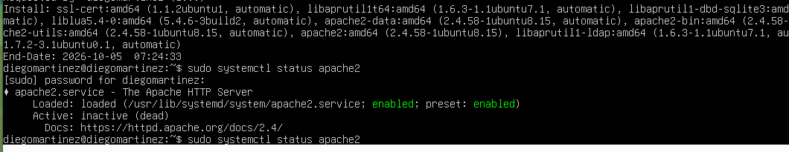
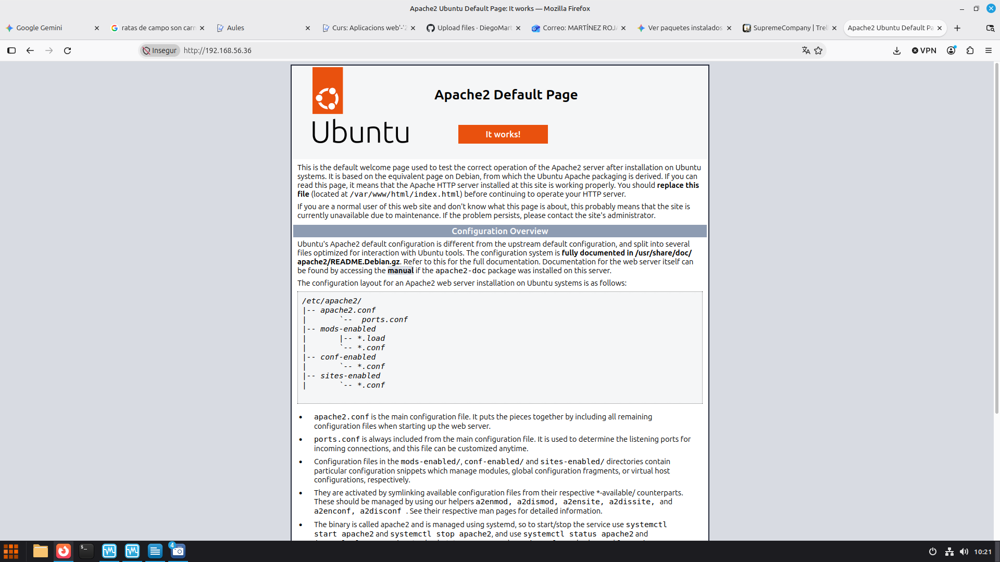

### Apartado 1: Comprobar el estado de ubuntu.server

Comprobamos el sistema.

**Comando ejecutado:**

Actualiza la lista de paquetes y el sistema:
```bash
sudo apt update
sudo apt upgrade -y
```
Comprueba la versión del sistema:

```bash
lsb_release -a

```


---

### Apartado 2: Instalación apacheCaptura-de-appweb 2.png
```bash
sudo apt install apache2 -y
```
Comprueba la versión instalada:

```bash
apache2 -v

```


### ¿Qué paquetes adicionales se han instalado como dependencias? (pista: revisa la salida de apt). ###
Los paquetes adicionales instalados como dependencias son: 
```bash
ssl-cert, libaprutil1t64, libaprutil1-dbd-sqlite3, liblua5.4-0, apache2-data, apache2-bin, apache2-utils, libaprutil1-ldap y libapr1t64

```
- - -
### Apartado 3. Comprobación del funcionamiento

3.1. Estado del servicio
```bash
sudo systemctl status apache2
```

3.2. Puertos en escucha

``bash
sudo ss -tulpn | grep apache2
``appweb

3.3. Prueba desde el terminal y desde el navegador
```bash
curl -I http://localhost
```

Desde el navegador (idealmente de otro equipo de la red) accede a http://IP_DE_TU_SERVIDOR. Debe aparecer la página "Apache2 Ubuntu Default Page".
Correcto

 Captura del estado del servicio 
 

 Captura página por defecto en el navegador
  
 
  3.4. Firewall (si está activo)

sudo ufw status

Salida:
Status inactive
sudo ufw allow 'Apache'

Salida:
 Rules updated
### ¿Qué diferencia hay entre los perfiles Apache, Apache Full y Apache Secure?

Apache: Abre solo el puerto 80 para tráfico web normal y sin encriptar (HTTP).

Apache Secure: Abre solo el puerto 443 para tráfico web seguro y encriptado (HTTPS).

Apache Full: Abre ambos puertos (80 y 443) para permitir tanto conexiones HTTP como HTTPS.

| Comando | Función |
| :--- | :--- |
| `sudo systemctl start apache2` | Inicia el servicio |
| `sudo systemctl stop apache2` | Detiene el servicio |
| `sudo systemctl restart apache2` | Reinicia (corta conexiones) |
| `sudo systemctl reload apache2` | Recarga la configuración sin cortar conexiones |
| `sudo systemctl enable apache2` | Arranque automático al iniciar el sistema |
| `sudo systemctl disable apache2` | Desactiva el arranque automático |
| `apache2ctl configtest` | Comprueba la sintaxis de la configuración |
| `apache2ctl -S` | Muestra los sitios (virtual hosts) cargados |
| `apache2ctl -M` | Lista los módulos cargados |
| `a2enmod` / `a2dismod` | Activa / desactiva módulos |
| `a2ensite` / `a2dissite` | Activa / desactiva sitios |
| `a2enconf` / `a2disconf` | Activa / desactiva fragmentos de configuración |

### ¿Cuándo conviene usar reload en lugar de restart?

Conviene usar reload en lugar de restart cuando haces cambios en la configuración y quieres aplicarlos sin cortar las conexiones activas de los usuarios, mientras que restart detiene por completo el servicio y corta todas las sesiones en curso.
 
