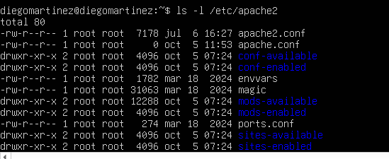
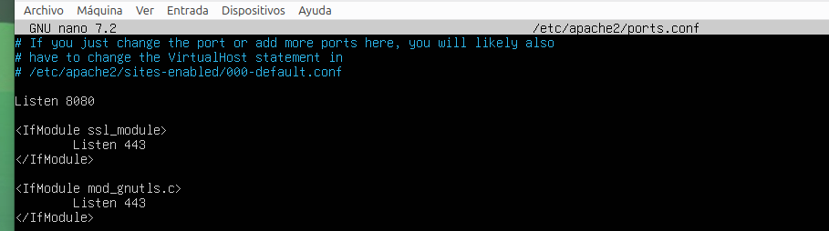

# Apartado 1: Comprobar el estado de ubuntu.server

Comprobamos el sistema.

**Comando ejecutado:**

Actualiza la lista de paquetes y el sistema:
```bash
sudo apt update
sudo apt upgrade -y
```
Comprueba la versión del sistema:

```bash
lsb_release -a

```


---

# Apartado 2: Instalación apacheCaptura-de-appweb 2.png
```bash
sudo apt install apache2 -y
```
Comprueba la versión instalada:

```bash
apache2 -v

```


### ¿Qué paquetes adicionales se han instalado como dependencias? (pista: revisa la salida de apt). ###
Los paquetes adiciuerto: Es una "puerta lógica" numérica (como el 80 o 8080) que usa la red para saber a qué aplicación exacta enviar los datos.onales instalados como dependencias son: 
```bash
ssl-cert, libaprutil1t64, libaprutil1-dbd-sqlite3, liblua5.4-0, apache2-data, apache2-bin, apache2-utils, libaprutil1-ldap y libapr1t64

```
- - -
# Apartado 3. Comprobación del funcionamiento

3.1. Estado del servicio
```bash
sudo systemctl status apache2
```

3.2. Puertos en escucha

``bash
sudo ss -tulpn | grep apache2
``appweb

3.3. Prueba desde el terminal y desde el navegador
```bash
curl -I http://localhostls -l /etc/apache2/sites-enabled/


```

Desde el navegador (idealmente de otro equipo de la red) accede a http://IP_DE_TU_SERVIDOR. Debe aparecer la página "Apache2 Ubuntu Default Page".
Correcto

 Captura del estado del servicio 
 

 Captura página por defecto en el navegador
  
 
  3.4. Firewall (si está activo)

sudo ufw status

Salida:
Status inactive
sudo ufw allow 'Apache'

Salida:
 Rules updated
# ¿Qué diferencia hay entre los perfiles Apache, Apache Full y Apache Secure?

Apache: Abre solo el puerto 80 para tráfico web normal y sin encriptar (HTTP).

Apache Secure: Abre solo el puerto 443 para tráfico web seguro y encriptado (HTTPS).

Apache Full: Abre ambos puertos (80 y 443) para permitir tanto conexiones HTTP como HTTPS.

# Apartado 4. Comandos principales de administración

| Comando | Función |
| :--- | :--- |
| `sudo systemctl start apache2` | Inicia el servicio |
| `sudo systemctl stop apache2` | Detiene el servicio |
| `sudo systemctl restart apache2` | Reinicia (corta conexiones) |
| `sudo systemctl reload apache2` | Recarga la configuración sin cortar conexiones |
| `sudo systemctl enable apache2` | Arranque automático al iniciar el sistema |
| `sudo systemctl disable apache2` | Desactiva el arranque automático |
| `apache2ctl configtest` | Comprueba la sintaxis de la configuración |
| `apache2ctl -S` | Muestra los sitios (virtual hosts) cargados |
| `apache2ctl -M` | Lista los módulos cargados |
| `a2enmod` / `a2dismod` | Activa / desactiva módulos |
| `a2ensite` / `a2dissite` | Activa / desactiva sitios |
| `a2enconf` / `a2disconf` | Activa / desactiva fragmentos de configuración |

# ¿Cuándo conviene usar reload en lugar de restart?

Conviene usar reload en lugar de restart cuando haces cambios en la configuración y quieres aplicarlos sin cortar las conexiones activas de los usuarios, mientras que restart detiene por completo el servicio y corta todas las sesiones en curso.

### Apartado 5. Ficheros y directorios importantes
Explora la estructura de configuración:

```bash
ls -l /etc/apache2/
```

 

| Ruta | Descripción |
| :--- | :--- |
| `/etc/apache2/apache2.conf` | Fichero de configuración principal |
| `/etc/apache2/ports.conf` | Puertos en los que escucha Apache |
| `/etc/apache2/sites-available/` | Sitios disponibles (definidos, no necesariamente activos) |
| `/etc/apache2/sites-enabled/` | Sitios activos (enlaces simbólicos a sites-available) |
| `/etc/apache2/mods-available/` y `mods-enabled/` | Módulos disponibles y activos |
| `/etc/apache2/conf-available/` y `conf-enabled/` | Fragmentos de configuración disponibles y activos |
| `/etc/apache2/envvars` | Variables de entorno (usuario y grupo de ejecución, etc.) |
| `/var/www/html/` | Directorio raíz por defecto (DocumentRoot) |
| `/var/log/apache2/access.log` | Registro de accesos |
| `/var/log/apache2/error.log` | Registro de errores |


## ¿Por qué Apache usa enlaces simbólicos entre los directorios *-available y *-enabled?
Comprueba que los ficheros de sites-enabled son enlaces simbólicos:
Apache usa enlaces simbólicos para separar la creación de un sitio o módulo de su activación: las configuraciones se guardan en *-available y solo se enlazan en *-enabled para activarse, lo que permite habilitar o deshabilitar servicios al instante sin borrar archivos ni alterar la configuración principal.

# Apartado 6. Modificaciones típicas del servicio
Haz siempre una copia de seguridad antes de modificar un fichero:

l fichero /etc/apache2/apache2.conf es el archivo de configuración principal y global de Apache.
 ### ¿Qué contenido tiene el fichero? Explícalo con tus palabras.
Contiene las directrices y parámetros fundamentales que controlan el funcionamiento general de todo el servidor web, tales como:
Las rutas de los directorios de logs y configuración.
Las directivas de seguridad y control de acceso por carpetas.
La carga de módulos adicionales y directivas de rendimiento (como tiempos de espera o límites de conexiones).


```bash
sudo cp /etc/apache2/apache2.conf /etc/apache2/apache2.conf.bak
``
6.1. Cambiar la página de inicio
```bash
echo "<h1>Servidor de TU NOMBRE</h1>" | sudo tee /var/www/html/index.html
```

Crea un texto Formato HTML con mi nombre en formato grande, usa tee para escribir dentro del fichero
otra forma seria sudo nano + fichero.

6.2. Cambiar el puerto de escucha (por ejemplo, al 8080)
### ¿Qué es un puerto?
 Es una "puerta lógica" numérica (como el 80 o 8080) que usa la red para saber a qué aplicación exacta enviar los datos.
 
### ¿Para qué sirve cambiar el puerto de escucha?
Sirve para evitar conflictos si el puerto por defecto (el 80) ya está ocupado por otro programa o servicio

Edita /etc/apache2/ports.conf y el VirtualHost de 000-default.conf:

```bash
sudo nano /etc/apache2/ports.conf
```
 Abre el archivo de configuración global para cambiar el puerto de escucha de Apache.



```bash
sudo nano /etc/apache2/sites-available/000-default.conf
```
Abre el archivo de configuración del sitio web para actualizar el puerto del servidor virtual y que coincida con el anterior.


Cambia Listen 80 por Listen 8080 y <VirtualHost *:80> por <VirtualHost *:8080>.esto sirve para mejorar la seguridad.
```bash
sudo apache2ctl configtest
Verifica que la configuración del servidor web Apache no tenga errores de sintaxis antes de aplicar cambios

sudo systemctl reload apache2
Recarga el servidor web para que aplique los cambios recientes en la configuración o en las páginas web sin necesidad de apagarlo por completo.

curl -I http://localhost:8080
Prueba que el servidor está respondiendo correctamente a través de la red simulando una petición web.
```
Vuelve a dejar el puerto 80 cuando termines este punto.

6.3. Definir el nombre del servidor (elimina el aviso "Could not reliably determine the server's fully qualified domain name")
```bash
echo "ServerName localhost" | sudo tee /etc/apache2/conf-available/servername.conf
sudo a2enconf servername
sudo systemctl reload apache2
```
6.4. Cambiar el correo del administrador (ServerAdmin en el fichero del sitio).
6.5. Personalizar una página de error (por ejemplo, 404) con la directiva ErrorDocument.

